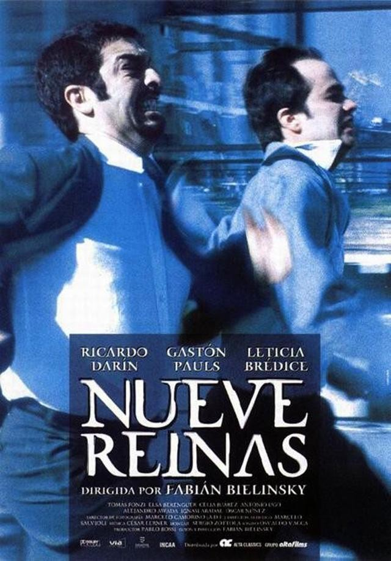
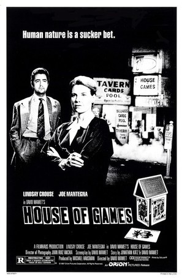
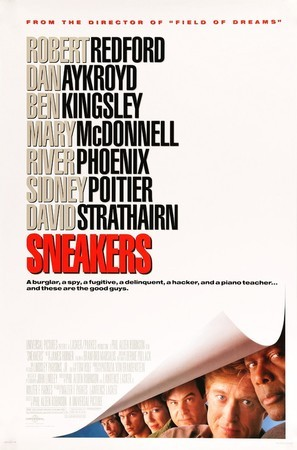
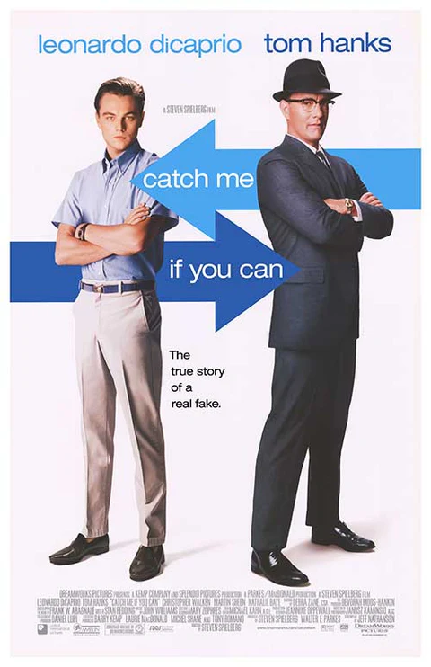

Social engineering has been known to us long before we called it by that name. Some may have known it as manipulation, swindle, scam, fraud, defraud, or deceive. According to the Spanish Royal Academy of Languages (RAE), to swindle is "To ask for or take money or things of value with artifice and deceit and with the intention of not paying."

Cinema has shown us how those who carry out these scams think. And here are 10 examples of films that help us understand how these social engineering scammers work:

### 10 Películas para Entender Cómo Funciona la Ingeniería Social
La ingeniería social existe desde mucho antes de que la conozcamos con ese nombre. Algunos podían conocerla como manipulación, estafa, timo, defraudar o engañar. Según la RAE, estafar es “Pedir o sacar dinero o cosas de valor con artificios y engaños y con ánimo de no pagar.”

El cine nos ha mostrado cómo piensan quienes realizan estas estafas. Y aquí tenéis 10 ejemplos de películas que nos ayudan a entender cómo trabajan estos estafadores expertos en ingeniería social:

---
### Nueve Reinas
<iframe width="560" height="315" src="https://www.youtube.com/embed/I42JYVjQkPI?si=yvgoSRAH04LVldgt" title="YouTube video player" frameborder="0" allow="accelerometer; autoplay; clipboard-write; encrypted-media; gyroscope; picture-in-picture; web-share" referrerpolicy="strict-origin-when-cross-origin" allowfullscreen></iframe>

### The Grifters
<iframe width="560" height="315" src="https://www.youtube.com/embed/Y-aSj4uiR90?si=wLxvKdalETOf8J4-" title="YouTube video player" frameborder="0" allow="accelerometer; autoplay; clipboard-write; encrypted-media; gyroscope; picture-in-picture; web-share" referrerpolicy="strict-origin-when-cross-origin" allowfullscreen></iframe>

### House of Games
<iframe width="560" height="315" src="https://www.youtube.com/embed/E9PMZp4I1uM?si=K76HN8rvxXmHeBQn" title="YouTube video player" frameborder="0" allow="accelerometer; autoplay; clipboard-write; encrypted-media; gyroscope; picture-in-picture; web-share" referrerpolicy="strict-origin-when-cross-origin" allowfullscreen></iframe>

### Dirty Rotten Scoundrels
<iframe width="560" height="315" src="https://www.youtube.com/embed/exqXoi878M4?si=20Z70hbAGumFWzj-" title="YouTube video player" frameborder="0" allow="accelerometer; autoplay; clipboard-write; encrypted-media; gyroscope; picture-in-picture; web-share" referrerpolicy="strict-origin-when-cross-origin" allowfullscreen></iframe>

### Sneakers
<iframe width="560" height="315" src="https://www.youtube.com/embed/DXWdj5-CTjI?si=8V4hFZPaZ9yF2VuG" title="YouTube video player" frameborder="0" allow="accelerometer; autoplay; clipboard-write; encrypted-media; gyroscope; picture-in-picture; web-share" referrerpolicy="strict-origin-when-cross-origin" allowfullscreen></iframe>

### Catch me if you can
<iframe width="560" height="315" src="https://www.youtube.com/embed/71rDQ7z4eFg?si=n_aD-_GcYywGjmd1" title="YouTube video player" frameborder="0" allow="accelerometer; autoplay; clipboard-write; encrypted-media; gyroscope; picture-in-picture; web-share" referrerpolicy="strict-origin-when-cross-origin" allowfullscreen></iframe>

### 7. [The Sting](https://www.youtube.com/watch?v=_nAIb_J9T5M)

### 8. [Ferris Bueller's Day Off](https://www.youtube.com/watch?v=0ZDbKhkLxTs)

### 9. [The Usual Suspects](https://www.youtube.com/watch?v=x3t0Nc6fg7w)

### 10. [The Shawshank Redemption](https://www.youtube.com/watch?v=PLl99DlL6b4)

---
